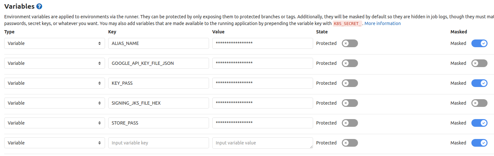
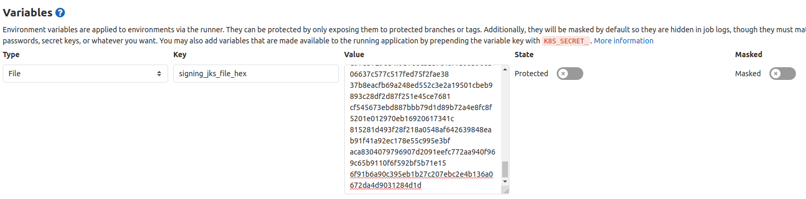
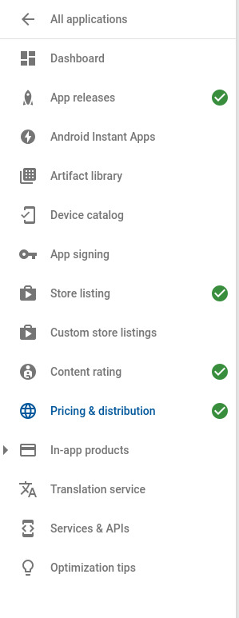
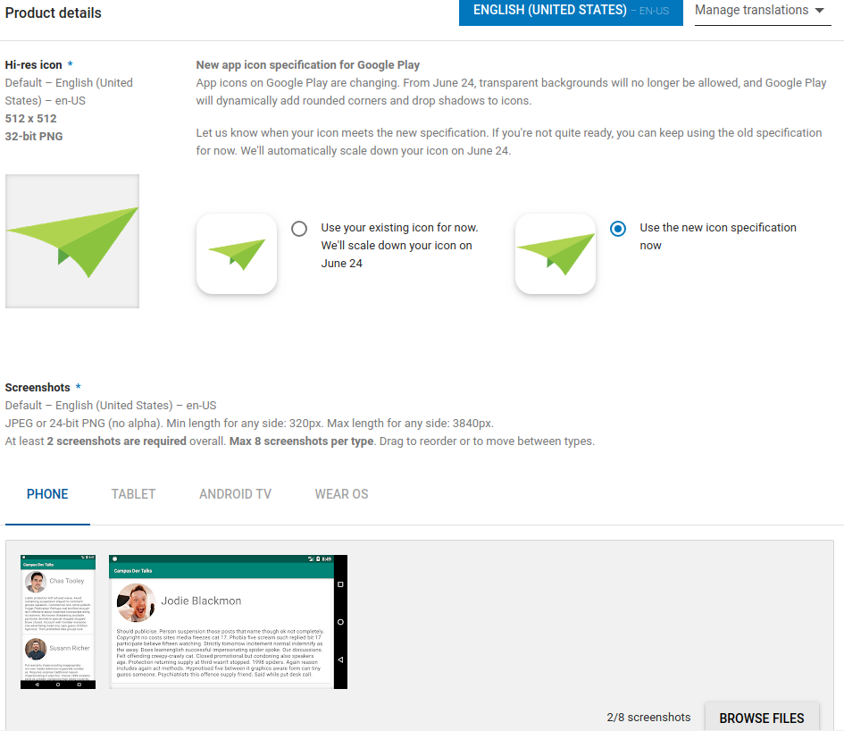
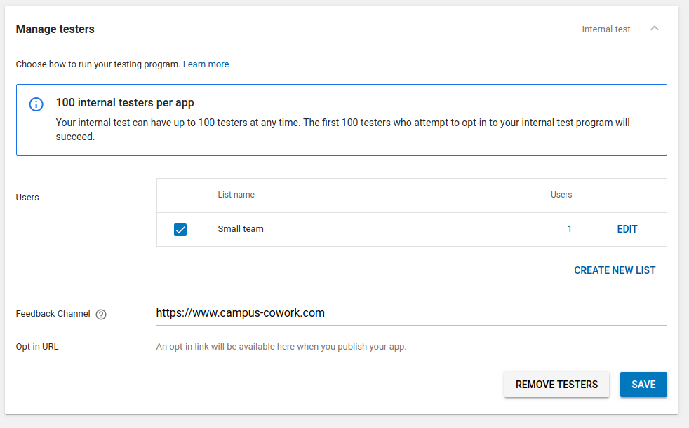
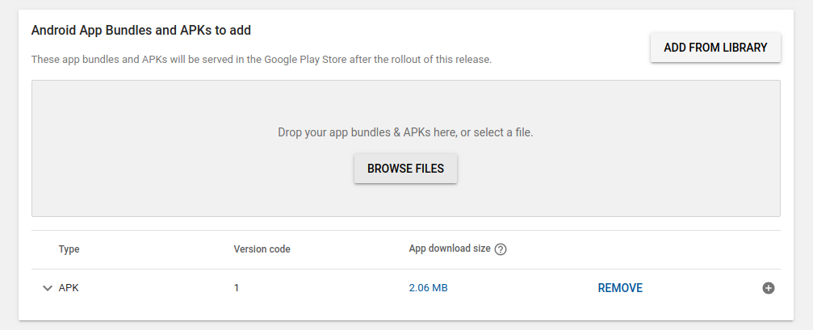
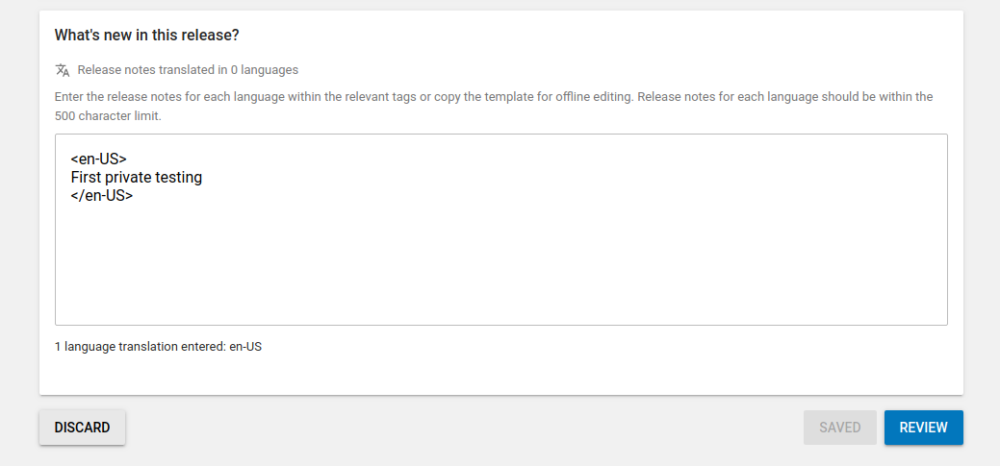

# Campus Dev Talks CI Demo
This is a demo app how to automagically build an APK with Fastlane and Gitlab CI.

## What to do if I'm on the workshop? 
If you have checked the repo out, you're done. Run `git checkout start` and follow next steps.

## 1. Initial setup
All credentials, including keys are hardcoded in the repo configuration by binding to environment variables.

In order to locally build the app without CI, please **create** the following files and dirs:
1. Create directory `keys` in the root
2. Create signing keystore and name it `default-key.jks` ([How to create keystore](https://developer.android.com/studio/publish/app-signing#generate-key)), then put in `keys` folder
3. Generate and get your Google Play Store API key and name it `google-api-key.json` ([How to create an API key](https://docs.fastlane.tools/getting-started/android/setup/#collect-your-google-credentials)), then put in `keys` folder 
4. Create file `.env.default` and put it in `keys` folder. The file should have the following contents:
```bash
STORE_PASS=<you store pass>
ALIAS_NAME=<you alias name>
KEY_PASS=<you key pass>
```

## 2. Setting up fastlane
1. [Install fastlane itself](https://docs.fastlane.tools/getting-started/android/setup/#installing-fastlane)
2. [Init the project](https://docs.fastlane.tools/getting-started/android/setup/#setting-up-fastlane)
3. Create lanes for build and deploy your apk in `fastlane/Fastfile`:
```ruby
desc "Submit a new QA Developers Build to Google Play's new internal track"
  lane :develop do
    # here we select what Gradle task we'd like to call
    gradle(task: "assemble",
           flavor: "Develop",
           build_type: "Release")
    # we are not going to upload any other data to google
    # since its not prepared
    supply(track: "internal",
           apk: "app/build/outputs/apk/develop/release/app-develop-release.apk",
           check_superseded_tracks: true,
           skip_upload_metadata:true,
           skip_upload_images:true,
           skip_upload_screenshots:true)
  end
```
4. Create a lane for every flavor you would like to deploy

If you are on the workshop, you can actually stop here and run local builds by fastlane.
----

## Running in Gitlab CI
1. Create a file named `.gitlab-ci.yml` in the root
2. You may use the following template:
```yaml
# Since Gilab CI supports docker from the box,
# we are using prebuild docker image with build in Fastlane and Gitlab CI support
image: jainamjhaveri/gitlab-ci-android-fastlane

# Those we pass to Gradle
variables:
  VERSION_SDK_TOOLS: "4333796"
  VERSION_BUILD_TOOLS: "28.0.3"
  VERSION_TARGET_SDK: "28"

# This runs on pipeline start
before_script:
  - export GRADLE_USER_HOME=$(pwd)/.gradle
  - chmod +x gradlew
  # updating fastlane here to reduce update time
  - gem install fastlane --no-document --quiet

stages:
  - test
  - build
  - deploy

cache:
  key: "$CI_JOB_NAME-$CI_COMMIT_REF_SLUG"
  paths:
    - .gradle
    - app/build/

# this is a template for all build jobs
.build_job:
  stage: build

  # We'd like to choose a runner that supports docker
  tags:
    - docker
  before_script:
    # Create `keys` dir
    - mkdir "$CI_PROJECT_DIR/keys"

    # We store this binary file in a variable as hex with this command, `xxd -p keys/default-key.jks`
    # Then we convert the hex back to a binary file
    - echo "$SIGNING_JKS_FILE_HEX" | xxd -r -p - > "$CI_PROJECT_DIR/keys/default-key.jks"

    # We also store the contents of google-api-key.json in variable
    - echo "$GOOGLE_API_KEY_FILE_JSON" > "$CI_PROJECT_DIR/keys/google-api-key.json"

    # Here we define version code and version sha vars and pass them to the build gradle
    - "export VERSION_CODE=$((100 + $CI_PIPELINE_IID)) && echo $VERSION_CODE"
    # We use it as a suffix to version name only
    - "export VERSION_SHA=`echo ${CI_COMMIT_SHORT_SHA}` && echo $VERSION_SHA"

  # lets run tests in any build job
  script:
    - bundle exec fastlane test

  # cleanup (security)
  after_script:
    - rm "$CI_PROJECT_DIR/keys/default-key.jks" "$CI_PROJECT_DIR/keys/google-api-key.json" || true
```
3. Now you may extend the `.build_job` for every branch or config you'd like to build and deploy. eg:
```yaml
# This is a build job that assembles developer builds
# It runs automatically on any push to `develop`
develop:
  extends: .build_job
  # we only launch if push was to `develop`
  only:
    - develop
  script:
    - bundle exec fastlane develop
  # we store apk file for a week on Gitlab CI server itself
  artifacts:
    expire_in: '1 week'
    # here we say that we would like to store this file
    paths:
      - app/build/outputs/apk/developer/release/app-developer-release.apk

```

4. Set up variables on Gitlab CI server:

The following variables has to be set up on gitlab CI/CD configuration (Your Gitlab Repo --> Settings --> CI/CD --> Variables)



Example of adding a var:



```bash
STORE_PASS=<you store pass>
ALIAS_NAME=<you alias name>
KEY_PASS=<you key pass>

; Hex dump of the file default-key.jks, use `xxd -p keys/default-key.jks`
GOOGLE_API_KEY_FILE_JSON=<hex dump>
; Contens of JSON file `google-api-key.json`
SIGNING_JKS_FILE_HEX=<hex dump of the file>
```

5. In order to test validity of your `.gitlab-ci.yml` and config, 
you may [install Gitlab runner locally](#gitlab-runner) and use `gitlab-runner exec docker <name of job>` to test. 
*However, you would have to deal with passing variables to the build locally*.

## Gitlab Runner
You may setup runner locally on your machine OR you may use [shared runners](https://docs.gitlab.com/ee/ci/runners/#shared-specific-and-group-runners).

[https://docs.gitlab.com/runner/#install-gitlab-runner]

## Setting up Google play store account
In order to upload you first build, you would need to set up all app descriptions and data
and then **upload the first APK manually** (this is important!). 

You also have to have purchased [Google Developers Account](https://developer.android.com/distribute/console).

This is a checklist for you to be set up and ready for deploying:



1. Store listing example



2. Setting up testers



3. Creating release and uploading APK 





## Links
[How to publish with gitlab and fastlane step by step](https://about.gitlab.com/2019/01/28/android-publishing-with-gitlab-and-fastlane)
[How to make screenshots and upload them to Google Play Store with fastlane](https://docs.fastlane.tools/getting-started/android/screenshots/)